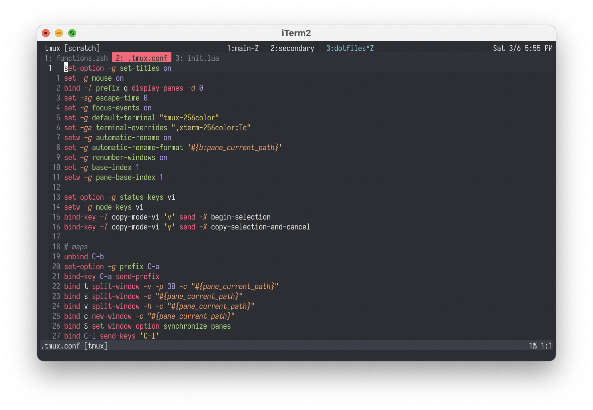
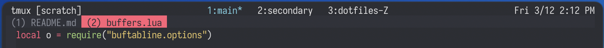
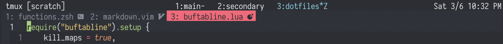

<!-- markdownlint-configure-file
{
  "line-length": false
}
-->

# buftabline.nvim

A low-config, minimalistic buffer tabline Neovim plugin written in Lua,
shamelessly inspired by [vim-buftabline](https://github.com/ap/vim-buftabline).



## Setup

Install using your favorite plugin manager and call the following Lua code
somewhere in your configuration:

```lua
require("buftabline").setup {}
```

If you're using [packer.nvim](https://github.com/wbthomason/packer.nvim), you
can install and set up buftabline simultaneously:

```lua
use {
    "jose-elias-alvarez/buftabline.nvim",
    requires = {"kyazdani42/nvim-web-devicons"}, -- optional
    config = function() require("buftabline").setup {} end
}
```

## Functionality

buftabline shows your open buffers in your tabline with (optional) filetype
icons, sorts them by (ordinal) number, and highlights the current buffer. That's
pretty much it.

For convenience, the plugin exposes 3 functions to interact with buffers in the
tabline by using the buffer's ordinal number:

- `go_to_buffer(number)`

  Does what you'd imagine. By default, the plugin maps `<Leader>0-9` to the
  corresponding `go_to_buffer` command (`0` gets converted to `10`), but you can
  disable this by setting `go_to_maps` to `false` (see [Options](#options)).

- `kill_buffer(number)`

  Again, self-explanatory. Not mapped by default, but you can have the plugin
  map `<Leader>c0-9` by setting `kill_maps` to `true` (see [Options](#options)).

- `custom_command(number)`

  By setting `custom_command` in your config, you can run an arbitrary command
  on a specific buffer in your tabline (see [Options](#options) for an example).

You can call any of these functions directly from Vimscript:

```vim
:lua require("buftabline").kill_buffer(5)
```

Or set custom maps:

```vim
nnoremap 1 <cmd> lua require("buftabline").go_to_buffer(1)<CR>
```

The plugin exposes the underlying function `buftarget(number, command)` and
allows access to enable creating more custom commands:

```vim
:lua require("buftabline").buftarget(1, "rightbelow sb")
```

Finally, the plugin adds the following Vim commands:

- `:ToggleBuftabline` (useful for smaller screens / focus sessions)

- `:BufNext` and `:BufPrev` (similar to `:bnext` and `:bprev`, but they skip
  over invisible buffers)

## Options

For most users, everything should work out-of-the-box, but the plugin exposes
the following options (defaults shown):

```lua
local options = {
    modifier = ":t",
    index_format = "%d: ",
    padding = 1,
    icons = false,
    start_hidden = false,
    disable_commands = false,
    go_to_maps = true,
    kill_maps = false,
    custom_command = nil,
    custom_map_prefix = nil,
    hlgroup_current = "TabLineSel",
    hlgroup_normal = "TabLineFill",
}
```

### modifier

Allows modifying the format of each buffer in the tabline. See `:help filename-modifiers`.

### index_format

Allows modifying the format of the index shown before each file's name in the
tabline. Lua's `string.format` function uses [C
directives](http://www.cplusplus.com/reference/cstdio/printf/), and you can also
change spacing and punctuation.

For example, setting `index_format = "(%d) "` will format your tabs like this:



### padding

Each digit of `padding` adds a space around each side of each tab. Set to `0` or
`false` to disable padding entirely.

### icons

Enables filetype icons via
[nvim-web-devicons](https://github.com/kyazdani42/nvim-web-devicons). Even if
you've installed nvim-web-devicons, you must explicitly enable icons by setting
this option to `true`, in case you don't want them in your tabline.



### start_hidden

Hides the tabline when Neovim starts by setting `showtabline` to `0`. Disabled
by default, but potentially useful in combination with `ToggleBuftabline`.

### disable_commands

Stops the plugin from creating commands in case you want to define your own.

### go_to_maps

Maps `<Leader>0-9` to the corresponding `go_to_buffer` command.

### kill_maps

Maps `<Leader>c0-9` to the corresponding `kill_buffer` command.

### custom_command

Defines the command that runs when calling `custom_command(number)`. Note that
calling the function without defining a command will throw an error.

A practical example: setting `custom_command` to `vertical sb` and calling `:lua require("buftabline").custom_command(2)` will open the 2nd buffer in your
tabline in a vertical split.

### custom_map_prefix

A simple way to map your `custom_command`. Setting `custom_map_prefix` to `v`
and setting `custom_command` to `vertical sb` will map `<Leader>v0-9` to open
the corresponding buffer in a vertical split.

Does nothing if you haven't set `custom_command`.

### hlgroup_current

Sets the highlight group for the current buffer.

### hlgroup_normal

Sets the highlight group for normal (non-current) buffers.

## Non-goals

- Non-ordinal numbers. LSP servers and plugins constantly create and
  delete temporary buffers, so I don't personally see the point.
- Vim support. Use [vim-buftabline](https://github.com/ap/vim-buftabline)!
- Mouse support.
- Extensive visual customization.

Aside from these, I'm open to PRs and hope to continue to improve the plugin,
but I don't think it'll change too much one way or another.

## Tests

I've covered most of the code with tests written with
[plenary.nvim](https://github.com/nvim-lua/plenary.nvim)'s test harness. Running
`./test.sh` from the plugin's root directory will run the test suite and exit
with a relevant exit code.

## Inspiration

- [nvim-bufbar](https://github.com/ojroques/nvim-bufbar) by
  [@ojroques](https://github.com/ojroques), who directed me to his plugin and
  encouraged me to use it as a starting point. A large percentage of the code in
  this plugin comes from his (any and all terrible Lua code is all my own).

- [vim-buftabline](https://github.com/ap/vim-buftabline), the direct inspiration
  for this plugin and still a solid plugin if you don't mind Vimscript.

- [lightline-bufferline](https://github.com/mengelbrecht/lightline-bufferline),
  which gave me the idea to "target" buffers in the tabline with commands.

- [nvim-bufferline](https://github.com/akinsho/nvim-bufferline.lua) and
  [barbar.nvim](https://github.com/romgrk/barbar.nvim), two tabline plugins that
  are far and away better than this one but are a little too much for my simple
  needs.
